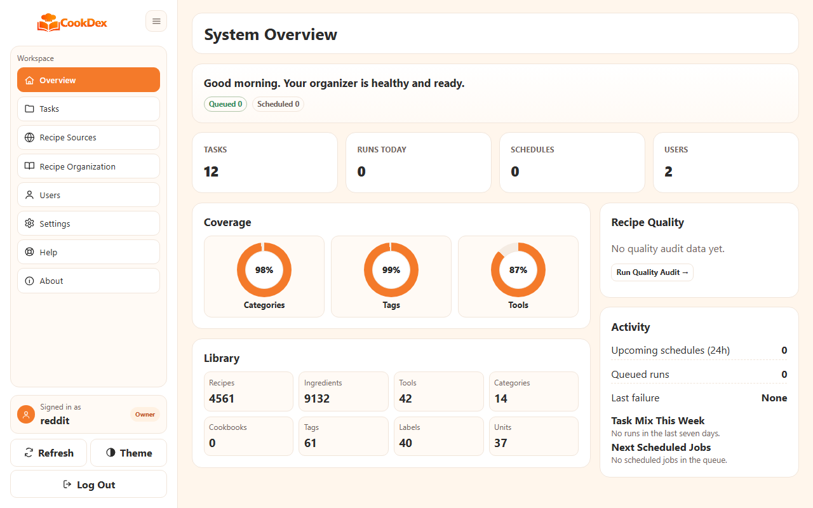
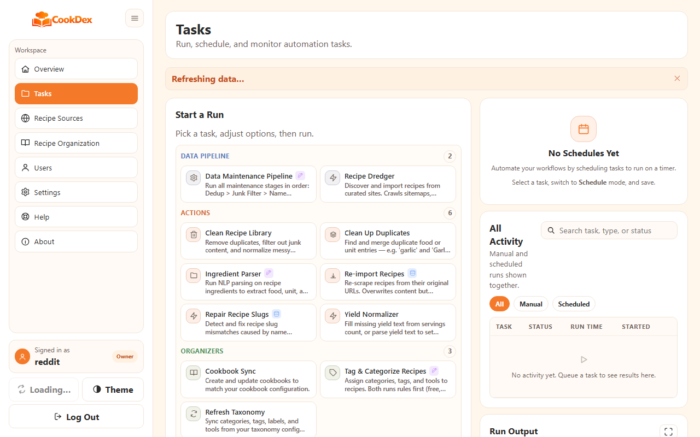
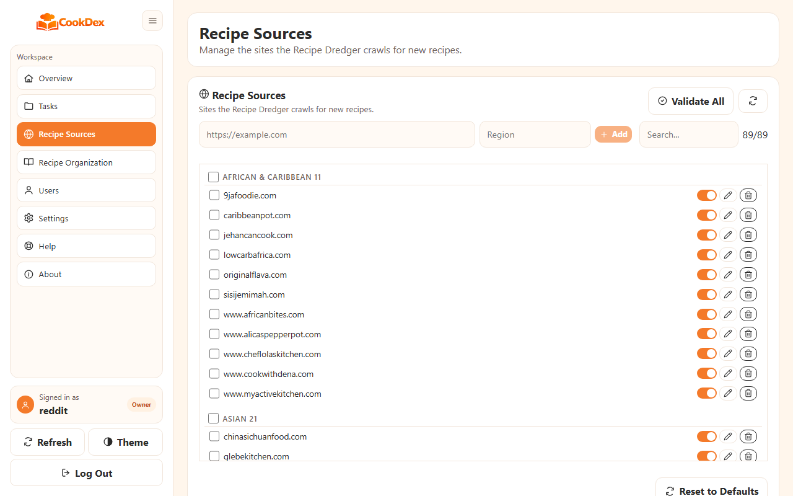
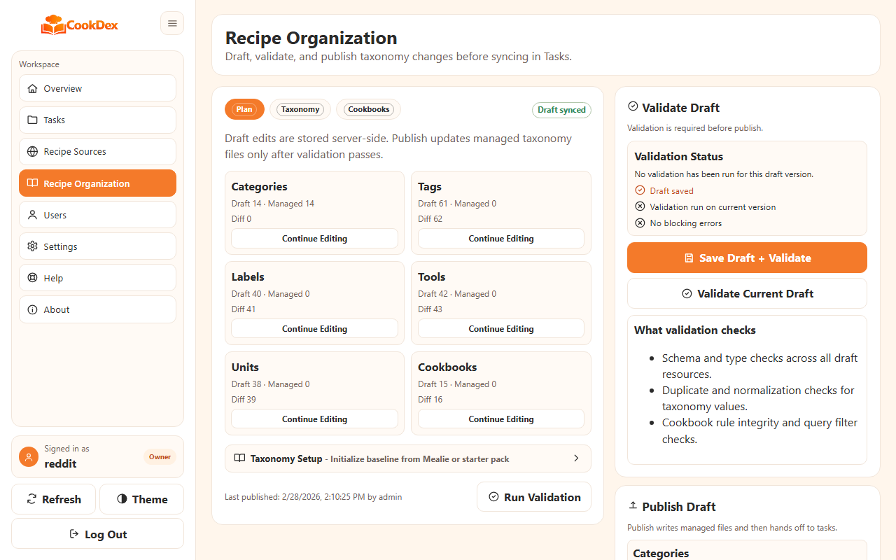
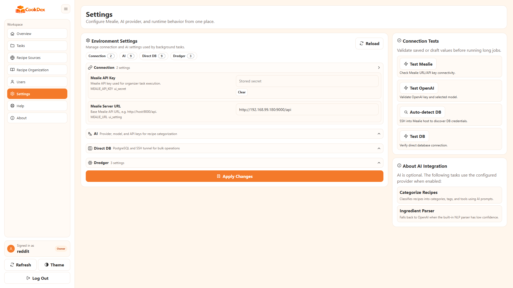

# CookDex

<p>
  
  
  
  
</p>

Web UI-first automation service for [Mealie](https://mealie.io). Manage recipe taxonomy, ingredient parsing, scheduled tasks, and runtime configuration from a single desktop-friendly interface.



| | |
|---|---|
|  |  |
|  |  |

## Quick Start

```bash
mkdir -p cookdex && cd cookdex
curl -fsSL https://raw.githubusercontent.com/thekannen/cookdex/main/compose.ghcr.yml -o compose.yaml
docker compose pull cookdex
docker compose up -d cookdex
```

Open `https://you.server.ip.address:4820/cookdex` (accept the self-signed certificate warning), create your admin account, then add your Mealie URL and API key in **Settings**.

No `.env` file is required — configuration is managed through the web UI.

## What It Does

| Feature | Description |
|---|---|
| Task runner | Queue one-off tasks with dry-run safety defaults |
| Scheduler | Interval and cron schedules managed in the UI |
| Recipe dredger | Discover and import recipes from curated sites via sitemap crawling |
| Taxonomy editing | Categories, tags, cookbooks, labels, tools, and units |
| Ingredient parsing | Multi-parser pipeline with confidence thresholds |
| Data maintenance | Staged cleanup pipeline across foods, units, and taxonomy |
| Settings | Runtime env vars and encrypted secrets managed in-app |
| User management | Multi-user auth with password complexity enforcement |

## Available Tasks

**Data Pipeline**
| Task ID | Purpose |
|---|---|
| `data-maintenance` | Run the full staged pipeline: dedup → junk filter → name normalize → ingredient parse → foods/units cleanup → labels/tools sync → taxonomy refresh → categorize → cookbook sync → yield normalize → quality audit → taxonomy audit |
| `recipe-dredger` | Discover and import recipes from curated sites — crawls sitemaps, verifies JSON-LD recipe schema, filters by language, and imports to Mealie |
| `mealie-backup` | Create a Mealie backup via the admin API, with optional pruning to keep only the newest N |

**Actions**
| Task ID | Purpose |
|---|---|
| `clean-recipes` | Remove URL duplicates, filter junk content, and normalize slug-derived names |
| `slug-repair` | Detect and fix recipe slug mismatches caused by name normalization (fixes require direct DB access) |
| `ingredient-parse` | Parse raw ingredient text into structured food, unit, and quantity |
| `yield-normalize` | Fill missing yield text from servings count, or parse yield text to set numeric servings |
| `cleanup-duplicates` | Merge duplicate food and/or unit entries |
| `reimport-recipes` | Re-scrape recipes from their original URLs, preserving tags, categories, and favorites |

**Organizers**
| Task ID | Purpose |
|---|---|
| `tag-categorize` | Tag and categorize recipes — rules first then AI (default), rules only (no LLM), or AI only |
| `taxonomy-refresh` | Sync managed categories, tags, labels, and tools into Mealie |
| `cookbook-sync` | Create and update cookbooks from cookbook configuration rules |

**Audits**
| Task ID | Purpose |
|---|---|
| `health-check` | Score recipes on completeness dimensions and audit taxonomy for unused/missing entries |

## API

All endpoints are under `/cookdex/api/v1`. Authentication is cookie-based.

<details>
<summary>Endpoint reference</summary>

**Auth**
- `GET /auth/bootstrap-status` — check if first-time setup is needed
- `POST /auth/register` — first-time admin registration
- `POST /auth/login` / `POST /auth/logout` / `GET /auth/session`

**Tasks and Runs**
- `GET /tasks` — list task definitions with policies
- `POST /runs` — queue a task run
- `GET /runs` / `GET /runs/{id}` / `GET /runs/{id}/log`
- `POST /runs/{id}/cancel`

**Policies**
- `GET /policies` / `PUT /policies` — manage safety policy overrides

**Schedules**
- `GET /schedules` / `POST /schedules`
- `PATCH /schedules/{id}` / `DELETE /schedules/{id}`

**Settings**
- `GET /settings` / `PUT /settings` — env vars and encrypted secrets
- `POST /settings/test/mealie` / `POST /settings/test/openai` / `POST /settings/test/ollama`
- `GET /settings/dredger-sites` / `POST /settings/dredger-sites` — list and add recipe sources
- `PUT /settings/dredger-sites/{id}` / `DELETE /settings/dredger-sites/{id}` — update and remove
- `POST /settings/dredger-sites/seed` / `POST /settings/dredger-sites/validate` — seed defaults and validate reachability

**Users**
- `GET /users` / `POST /users`
- `POST /users/{username}/reset-password` / `DELETE /users/{username}`

**Config Files**
- `GET /config/files` / `GET /config/files/{name}` / `PUT /config/files/{name}`

**Meta**
- `GET /health` / `GET /metrics/overview` / `GET /about/meta` / `GET /help/docs`

</details>

## Environment Variables

CookDex starts with no required environment variables. A `.env` file is optional — create one only to override defaults.

| Variable | Default | Description |
|---|---|---|
| `WEB_BIND_HOST` | `0.0.0.0` | Server bind address |
| `WEB_BIND_PORT` | `4820` | Server port |
| `WEB_BASE_PATH` | `/cookdex` | URL base path |
| `WEB_SSL` | `true` | HTTPS with auto-generated self-signed cert; set `false` behind a reverse proxy |
| `WEB_SSL_CERTFILE` | | Path to your own TLS certificate (PEM) |
| `WEB_SSL_KEYFILE` | | Path to your own TLS private key (PEM) |
| `WEB_COOKIE_SECURE` | *(auto)* | Follows `WEB_SSL` by default; override only if needed |

For headless or automated deployments:

| Variable | Description |
|---|---|
| `WEB_BOOTSTRAP_PASSWORD` | Pre-create admin user on first start (skips UI registration) |
| `MO_WEBUI_MASTER_KEY` | Override the auto-generated encryption key |
| `MEALIE_URL` | Pre-seed Mealie URL (can also be set in UI) |
| `MEALIE_API_KEY` | Pre-seed Mealie API key (can also be set in UI) |

The Recipe Dredger reads these from Settings:

| Variable | Default | Description |
|---|---|---|
| `DREDGER_TARGET_LANGUAGE` | `en` | ISO language code — recipes in other languages are rejected |
| `DREDGER_CRAWL_DELAY` | `2.0` | Seconds between requests to the same domain |
| `DREDGER_CACHE_EXPIRY_DAYS` | `7` | Days before cached sitemaps are re-crawled |

After first login, all provider settings are managed from the Settings page.

## Direct DB Access (Optional)

The `health-check`, `yield-normalize`, `tag-categorize`, `slug-repair`, and `reimport-recipes` tasks support a `use_db` option that bypasses the Mealie HTTP API and reads/writes directly to the database. This is dramatically faster for large libraries — a 3000-recipe quality audit completes in ~2 seconds instead of several minutes. For `tag-categorize` (rule-based method), it also unlocks ingredient-matching and tool-detection rules that are not available via the API.

All DB dependencies are included in the Docker image — no extra installation needed.

**Quick path:** Run the setup wizard on your Docker host — it handles SSH keys, volume mounts, and settings in one command:

```bash
docker cp cookdex:/app/scripts/setup-db-tunnel.sh /tmp/setup-db-tunnel.sh && bash /tmp/setup-db-tunnel.sh
```

Then open Settings and click **Auto-detect DB**. See [Direct DB Access](docs/DIRECT_DB.md) for details and manual setup instructions.

## Docker Volumes

| Host path | Container path | Purpose |
|---|---|---|
| `./cache` | `/app/cache` | SQLite state database, encryption key, and TLS certificate |
| `./logs` | `/app/logs` | Task run logs |
| `./reports` | `/app/reports` | Audit/maintenance reports |

## Updating

```bash
docker compose pull cookdex
docker compose up -d --remove-orphans cookdex
```

Verify health after update:

```bash
curl -k https://localhost:4820/cookdex/api/v1/health
```

## Documentation

- [Install](docs/INSTALL.md) — full deployment walkthrough
- [Getting Started](docs/GETTING_STARTED.md) — first login and first task run
- [Local Dev](docs/LOCAL_DEV.md) — run and test locally without Docker
- [Tasks](docs/TASKS.md) — task reference and safety policies
- [Data Maintenance](docs/DATA_MAINTENANCE.md) — staged cleanup pipeline
- [Direct DB Access](docs/DIRECT_DB.md) — optional direct PostgreSQL/SQLite access for bulk tasks

## Security

- All secrets encrypted at rest with Fernet (PBKDF2-derived key)
- Passwords hashed with PBKDF2-HMAC-SHA256 (390k iterations)
- Session cookies: HttpOnly, Secure, SameSite=Lax
- CSRF protection via `X-Requested-With` header validation
- CSP, X-Frame-Options, X-Content-Type-Options, Referrer-Policy headers
- SSRF protection with IP validation (blocks cloud metadata endpoints)
- Rate limiting on login (5 attempts / 5 min) and actions (30 / min)
- Subprocess isolation — tasks receive a minimal environment, not the full parent env
- No `shell=True`, `eval()`, or string-interpolated SQL anywhere in the codebase

## Privacy

CookDex does not phone home, collect telemetry, or include any analytics or tracking. Your data stays on your server.

- **No telemetry or analytics** — zero outbound requests to Anthropic, CookDex, or any third party
- **Credentials stored locally** — API keys and passwords are encrypted at rest (Fernet) and never leave your instance
- **Network access** — CookDex communicates only with your Mealie instance and, during recipe dredging, the recipe sites you configure
- **AI categorization** — if enabled, recipe names and ingredient lists are sent to your configured provider (OpenAI API or your own Ollama instance). No other recipe data is transmitted
- **No cookies or tracking** — session cookies are used for authentication only (HttpOnly, Secure, SameSite=Lax)

## Accessibility

The web UI targets WCAG 2.1 AA compliance:

- Keyboard-navigable with visible `:focus-visible` indicators on all interactive elements
- All icon-only buttons have `aria-label` attributes
- Form inputs have associated labels (explicit or via `aria-label`)
- Tables use `scope="col"` on headers with sr-only labels for action columns
- Status updates announced to screen readers via `role="alert"` and `role="status"`
- `@media (prefers-reduced-motion: reduce)` disables all animations
- Dark mode with tested contrast ratios

## Testing

```bash
python -m pytest
```

## Local Web UI QA Loop

```bash
python scripts/qa/run_local_webui_qa.py --iterations 3
```

Artifacts are written to `reports/qa/loop-*/` with smoke test results, screenshots, and server logs.
